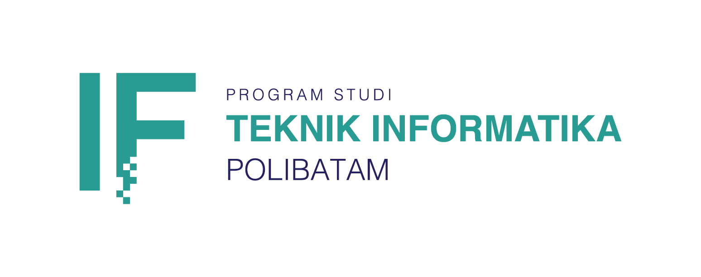

# Geoportal Apps Mobile

<p align="center">
  
</p>

Geoportal adalah aplikasi mobile yang dirancang untuk mempermudah masyarakat dalam mengakses informasi perumahan dan permukiman secara efisien. Aplikasi ini mendukung perencanaan dan pengembangan wilayah di Kota Batam melalui penyediaan data spasial yang terpusat.

Geoportal dikembangkan sebagai bagian dari upaya mendukung program pemerintah di bidang perumahan dan permukiman. Aplikasi ini memanfaatkan peta interaktif berbasis GeoJSON serta dilengkapi dengan fitur pengelolaan data lokasi (CRUD), unggah koordinat, unggah foto, dan pengunduhan data.

## 📱 Fitur Utama

### 🔐 **Login & Register**  
  - Pengguna dapat membuat akun dan masuk ke dalam aplikasi.

### 🗺️ **Tampilan Informasi Perumahan dan Permukiman di Peta**  
  - Data ditampilkan secara interaktif melalui peta berbasis GeoJSON.

### ✏️ **Input, Ubah dan Hapus Data Umum dan Spasial**  
  - Mengelola informasi perumahan dan permukiman, termasuk nama lokasi, jenis kawasan, serta atribut lainnya.

### 📍 **Input, Ubah dan Hapus Koordinat Lokasi**  
  - Mengelola titik koordinat lokasi secara langsung dari peta interaktif.

### 📸 **Input, Ubah dan Hapus Foto Lokasi**  
  - Mengelola foto lokasi menggunakan galeri perangkat.

### ⬇️ **Unduh Data Lokasi**  
  - Pengguna dapat mengunduh data lokasi dalam format terstruktur dalam format PDF.

### 🧭 **Akses dan Navigasi Peta Interaktif**  
  - Berbasis Flutter Map, pengguna dapat menelusuri dan memantau persebaran data lokasi secara interaktif.  
  Tersedia dua jenis tampilan peta yang dapat dipilih:
    - 🗺️ **Peta Biasa (OpenStreetMap)**
    - 🛰️ **Peta Satelit (ESRI Satellite)**

## 🖼️ Screenshots Tampilan Aplikasi

<p align="center">
  <table>
    <tr>
      <th>Beranda</th>
      <th>Layar Peta</th>
      <th>Detail Peta</th>
    </tr>
    <tr>
      <td></td>
      <td></td>
      <td></td>
    </tr>
  </table>
</p>

## ⚙️ Prasyarat

- 
- 
- 
- 
- 

## 🚀 Instalasi

1. Clone repositori

   ```bash
   git clone https://github.com/fadliaditya06/Geoportal-Mobile.git
   cd Geoportal-Mobile
   ```

2. Install dependensi:

   ```bash
   flutter pub get
   ```

3. Setup Firebase:

   - Buat project baru di [Firebase Console](https://console.firebase.google.com/)
   - Tambahkan aplikasi Android ke Firebase:
     - Isi nama package sesuai dengan aplikasi Flutter
     - Unduh file `google-services.json`
     - Letakkan file tersebut di dalam folder: `android/app/`
   - Pastikan fitur berikut aktif di Firebase console:
     - **Firebase Authentication**
     - **Cloud Firestore**

4. Setup Supabase:

   - Daftar di [https://supabase.com](https://supabase.com) dan buat project baru
   - Buka menu **Storage → Buckets**, lalu:
     - Buat bucket dengan nama `images`
     - Centang **public access**
     - Di dalam bucket `images`, buat dua folder:
       - `foto_lokasi`
       - `foto_profil`
   - Buka **Project Settings → API Keys**, lalu salin:
     - **Anon Public Key (Anon Key)**
   - Buka **Project Settings → Data API**, lalu salin:
     - **URL (Project URL)**
   - Simpan nilai tersebut di file `.env` atau langsung inisialisasi di `main.dart`

5. Jalankan aplikasi:
   ```bash
   flutter run
   ```

## 🛠️ Teknologi dan Dependensi

| Teknologi               | Deskripsi                                                                   |
| ----------------------- | --------------------------------------------------------------------------- |
| **Flutter**             | Framework UI untuk membangun aplikasi mobile                                |
| **Dart**                | Bahasa pemrograman utama yang digunakan oleh Flutter                        |
| **Firebase**            | Backend untuk login, register, dan penyimpanan data di Firestore            |
| **Supabase Storage**    | Cloud storage untuk mengunggah dan mengambil gambar                         |
| **Flutter Map**         | Library berbasis Leaflet untuk menampilkan peta interaktif                  |
| **OpenStreetMap (OSM)** | Peta dasar sumber terbuka yang digunakan untuk navigasi lokasi              |
| **ESRI Satellite**      | Layanan peta satelit untuk visualisasi spasial berbasis citra               |
| **Image Picker**        | Plugin untuk mengambil gambar dari kamera atau galeri perangkat             |
| **latlong2**            | Library untuk menangani data koordinat (latitude & longitude)               |
| **GeoJSON Dataset**     | Format data spasial yang digunakan untuk menampilkan area perumahan di peta |

## 👥 Kontributor

| Nama & NIM                                | Peran                                      |
| ----------------------------------------- | ------------------------------------------ |
| Ir. Farouki Dinda Rassarandi, S.T., M.Eng | Klien dan Manajer Proyek                   |
| 3312301006 – Fadli Aditya Suhairi         | Ketua Tim & Fullstack Mobile Developer     |
| 3312301012 – Faradilla Zahara             | Frontend Mobile Developer & UI/UX Designer |
| 3312301022 – Isma Rapmaria Silitonga      | Frontend Mobile Developer & UI/UX Designer |
| 3312301122 – Ainaya Nurfaddilah           | Frontend Mobile Developer & UI/UX Designer |

<table align="center">
  <tr>
    <td align="center">
      
    </td>
    <td align="center">
      
    </td>
  </tr>
</table>
